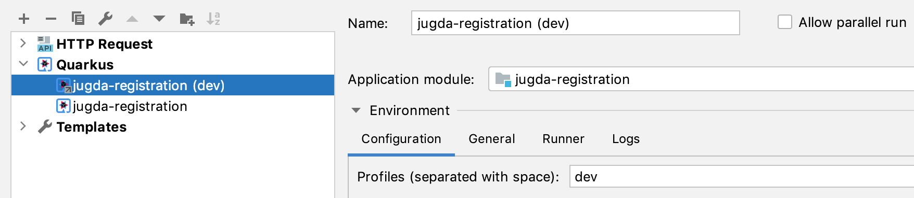

= JUG Registration App
:icons: font

https://quarkus.io[Quarkus] based application.

== Usage / Integration Configuration

Should be embedded in an `<iframe>` on the page.

Root page is `/registration?eventId=...`.

=== Query Params

|===
|Param name |default |Note

|eventId
|-
|The eventId as `yyyy-mm-dd` (date in ISO format). Required.

|limit
|60
|Participant limit

|showPub
|false
|If `true`, the checkbox for pub participation will be shown, otherwise not.

|hideVideoRecording
|false
|If `true`, the checkbox for accepting video recording will be hidden, otherwise not.

|deadline
|Date of eventId, 18:00:00+02:00
|ISO timestamp. Registration closes after given deadline.

|opensBeforeInMonths
|1
|Months before an event takes place the registration is available/opened

|===

== Development

=== Prerequisites

* JDK 11+
* IDE
* Maven 3.6.2+
[[local-environment]]
* Docker (optional, for local development)

=== Development with profile `localstack`

https://github.com/localstack/localstack[localstack] enables local development without any AWS cloud access. +
We use the Docker container of localstack directly without the need to install any additional tool locally.

* For <<local-environment,local AWS development>>, simply power up the provided `docker-compose.yml` file in the `src/docker` folder with `docker compose up` command. +
The container will start and initialize all the needed AWS resoures like DynamoDB, S3 bucket and files and SES, available at http://localhost:4566
* (Optional) Build application: `mvn clean package`
* Run application with `localstack` profile:
** With Maven, use https://quarkus.io/guides/maven-tooling#development-mode[Quarkus Development Mode]: `mvn compile quarkus:dev -Dquarkus.profile=localstack`
+
TIP: You can now change classes, configurations and other resources on the fly and Quarkus will automatically reload on the next call.
+
[IMPORTANT]
====
If an error occurs: "software.amazon.awssdk.core.exception.SdkClientException: Unable to load credentials from any of the providers in the chain", you need to set following env variables (dummy value is ok for localstack usage, it will automatically set when using the IntelliJ localstack run config):
----
AWS_ACCESS_KEY_ID=dummy
AWS_SECRET_ACCESS_KEY=dummy
----
====

** In IntelliJ start via run configuration:
+

+
IMPORTANT: Change the `dev` profile in the image with `localstack`
+
TIP: This makes it even possible to run the application in debug mode.

=== Run HTTP requests to test registration

[source]
----
include::registration-requests.http[]
----
<1> Show the current number of registrations and the HTML form to register
<2> Register participant for an event
<3> Upload additional webinar data to event
<4> Send e-mail message to participants
<5> Show overview of events
<6> Event administration UI (send mail, upload Webinar data)
<7> Show Webinar data
<8> Delete registration by unique key (_Caution_: This request is incomplete, you need to add the unique id you received on registration)
<9> Delete registration of participant by eventId and e-mail address
<10> Delete registration by eventId and unique key (_Caution_: This request is incomplete, you need to add the unique id you received on registration)

NOTE: Find/change the variables in link:http-client.env.json[].

== Build

Native, Docker will be used.

 $ mvn clean package -Pnative

== Deployment

https://www.serverless.com/[Serverless Framework]

=== JUG DA

 $ TENANT=jugda sls deploy

=== Cyberland

 $ TENANT=cyberland sls deploy
